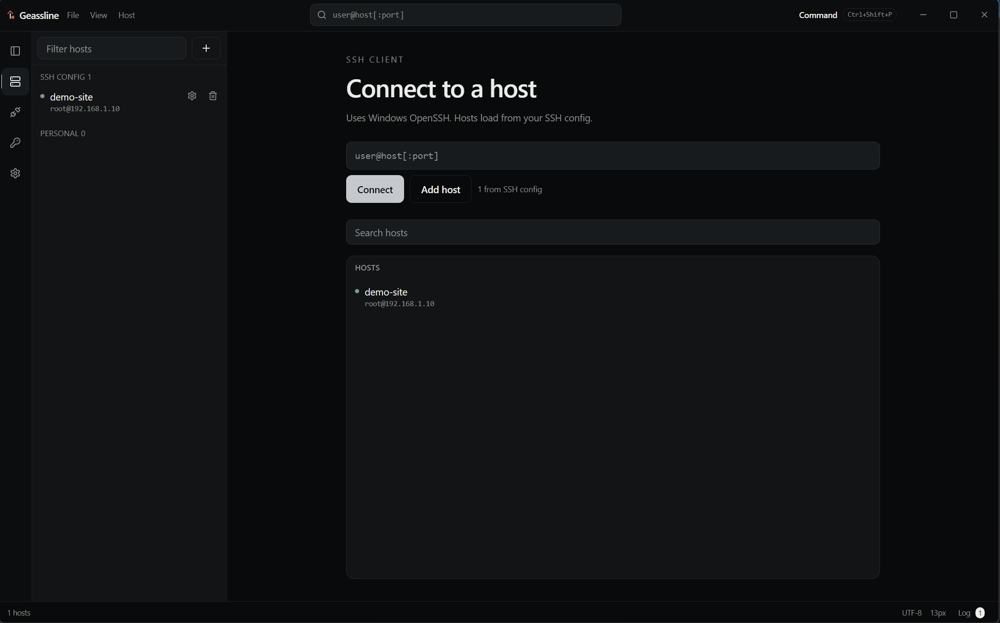

# Geassline

Offline Windows SSH client. A lightweight stand-in for Termius, Tabby, and VS Code Remote SSH — terminals, files, editor, and tunnels, using **Windows OpenSSH** and your existing SSH config. 

I am not planning to release a compiled build here, if you are using similar tools as your daily tasks, you should be able to compile it with ease.

[](LICENSE)
[](#requirements)
[](#requirements)




## Features

- **Real SSH** — spawns Windows OpenSSH (`ssh.exe`). Password, public key, and FIDO2 (`sk-ssh-ed25519`) identities.
- **Your config is the database** — reads `%USERPROFILE%\.ssh\config` (or a file you pick). Hosts, keys, `ProxyJump`, `ForwardAgent`, and forwards stay in that file. The path is remembered.
- **Sessions** — open hosts in tabs. Pin, search, and jump from the home screen or the host list.
- **Files** — browse, upload, download files and folders, follow symlinks, edit as root (sudo password when required). Works without a remote SFTP daemon.
- **Editor** — remote files with syntax highlighting (C/C++ headers, Python, Go, Rust, YAML, Nginx, Terraform/HCL, Docker, GraphQL, and the rest of the CodeMirror set). Ctrl+S saves back over SSH.
- **Tunnels** — Local (`-L`), Remote (`-R`), and Dynamic / SOCKS (`-D`). Forwards in SSH config start with the first terminal. Ad-hoc tunnels stay in the app unless you choose **Write to SSH config**.
- **Terminal** — xterm.js, Windows-style copy/paste (Ctrl+C copies a selection then clears it; otherwise interrupt). Themes and font size in Settings.
- **Offline** — no account, no telemetry, no internet required.

## Requirements

- Windows 10 or 11 (x64)
- [OpenSSH Client](https://learn.microsoft.com/en-us/windows-server/administration/openssh/openssh_install_firstuse) (`C:\Windows\System32\OpenSSH\ssh.exe`)
- For FIDO2: a security key and a key file such as `id_ed25519_sk` (`ssh-keygen -t ed25519-sk`)

## Build from source

Needs **Node.js 22+**, **npm**, **Python 3**, and `unzip` (Linux/macOS) or `tar` (Windows). Electron 32.3.3 is downloaded once into `desktop/.cache/`.

```bash
git clone https://github.com/<you>/geassline.git
cd geassline
npm install
npm run pack:windows
```

Output:

- `desktop/dist/Geassline/` — runnable folder
- `desktop/dist/Geassline-windows-x64.zip` — same tree, zipped

You can pack the Windows zip from Windows, Linux, or macOS. The app itself runs on Windows: unzip the output and open **`electron.exe`** (do not rename it).

Types: `npm run typecheck`. Full packer notes: [BUILD.md](BUILD.md).

## Configuration

| | |
| --- | --- |
| SSH config | Settings → SSH config file, or the default `~\.ssh\config` |
| Hosts | Add/edit in the app; saved hosts are written to that config |
| Keys | Paths already listed in the config (`IdentityFile`) |
| Tunnels | Imported from `LocalForward` / `RemoteForward` / `DynamicForward`; optional save back |

## Known limits

- Windows OpenSSH does **not** multiplex FIDO2. Extra terminals and the Files tab after the first login may ask you to touch the key again.
- There is no code-signing certificate in this repo. Unsigned Electron apps can be flagged on first download. An EV/OV Authenticode cert is the durable fix for Defender/SmartScreen.
- Linux and macOS clients are not packaged.

## Project layout

```
src/                      UI (React). Desktop entry: src/desktop-entry.tsx
desktop/electron/         Electron main, preload, OpenSSH bridge
scripts/pack-electron-windows.mjs
docs/screenshot.png       App screenshot (replace this file)
```

Generated (gitignored): `node_modules/`, `desktop/dist/`, `desktop/.cache/`, `desktop/electron/ui/`.

## Contributing

Issues and pull requests are welcome. Keep SSH behavior on Windows OpenSSH; do not reintroduce a bundled `ssh2` stack or rename `electron.exe` in the packer.

## License

[MIT](LICENSE) © Geassline contributors
